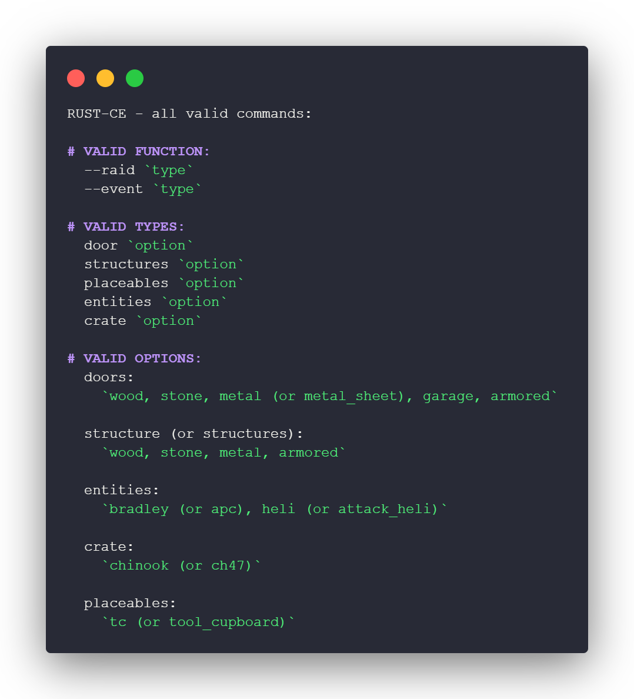

# Rust CE: Calculator
Simple raid/event helper for Rust Console Edition that I've made in 40 minutes for a C# assignment.

***

### Commands:

**NOTE:** I don't have plans on working in this project. I'm just uploading it here so I dont lose the project or In case I decide to work on it again. 🤷
